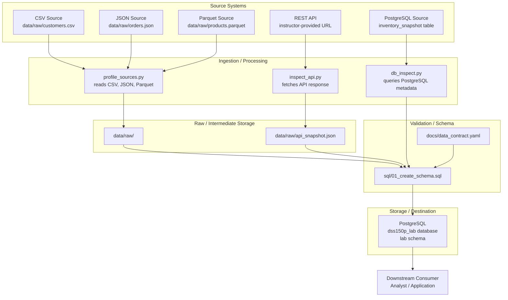

# Data Engineering Lifecycle Map

## Lifecycle Table

| Lifecycle Element | What It Means | Example in This Lab | Primary Tool/Artifact | Possible Failure |
|-------------------|---------------|---------------------|----------------------|------------------|
| Source system | The original system or location where data is created or stored before entering the pipeline. | Customer records in CSV, order records in JSON, product records in Parquet, REST API JSON response, PostgreSQL table such as `inventory_snapshot`. | Raw files in `data/`, instructor-provided REST API, PostgreSQL database | Source system unavailable, schema changes without notice, corrupted or incomplete data export. |
| Ingestion/acquisition | Bringing data from the source system into the local environment. | Reading CSV with pandas, loading JSON and Parquet, requesting the REST API with `requests`, connecting to PostgreSQL with SQLAlchemy. | `src/profile_sources.py`, `src/inspect_api.py`, `src/verify_environment.py`, `src/fetch_api.py` | Network timeout, missing file, incorrect path, authentication failure, API rate limit. |
| Storage | Where data is held after acquisition. | Raw files stored under `data/raw/`, PostgreSQL data stored in Docker named volume `dss150p_pgdata`, future processed tables in `lab` schema. | Local filesystem, Docker volume, PostgreSQL | Disk space exhaustion, volume deletion or corruption, permission issues, data loss. |
| Processing/transformation | Cleaning, shaping, preparing data for analysis or storage. | Profiling source files with pandas, detecting duplicate rows, inferring data types, creating and applying SQL schema. | pandas, Python scripts, `sql/01_create_schema.sql` | Data type mismatch, incorrect handling of missing values, transformation logic bugs, accidental data loss. |
| Data quality/validation | Checking data against rules to ensure accuracy, completeness, and consistency. | Null counts, duplicate row detection, distinct value counts, min/max for numeric fields, data contract quality rules. | `src/profile_sources.py`, `docs/data_contract.yaml` | Unnoticed nulls in key fields, duplicate records, out-of-range values, invalid dates. |
| Delivery | Providing data to downstream consumers in a usable form. | Querying PostgreSQL tables, exposing data through SQL views or reports, saving API snapshots. | SQL queries, database views, `data/raw/api_snapshot.json` | High latency, incorrect aggregation, missing access permissions, stale data. |
| Consumer | The person, application, or system that uses the final data. | Analytics team, business analyst, downstream application or dashboard. | Documentation, dashboards, reports | Misinterpretation of data, unmet requirements, lack of documentation, incorrect assumptions. |

## Data Flow Diagram

